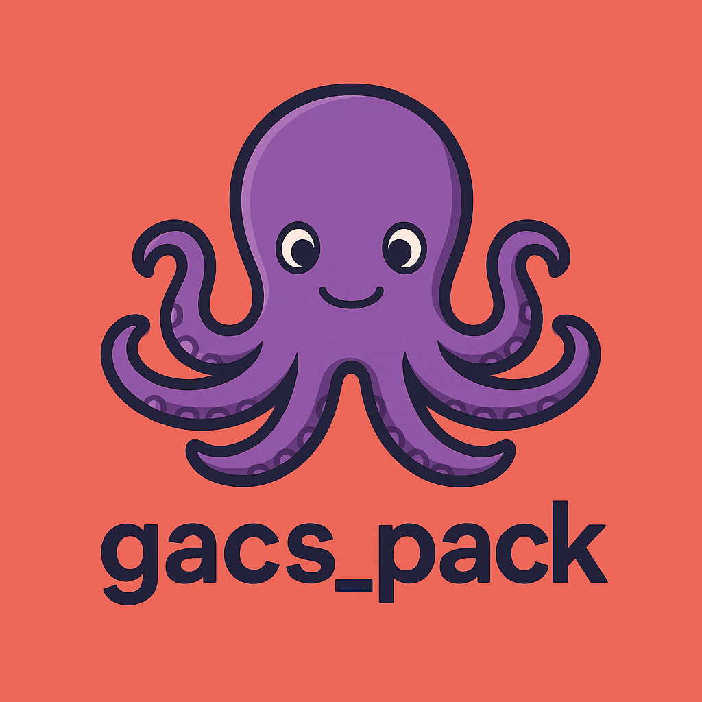

#  gacs_pack

[](https://badge.fury.io/rb/gacs_pack)
[](https://github.com/Patientevity/gacs_pack/actions)
[](https://opensource.org/licenses/MIT)
[](https://www.ruby-lang.org/en/)

> **gacs_pack** — the Graph‑Aware Context System for Rails.
> Build token‑budgeted, auditable context packs for AI agents with role‑ and intent‑specific awareness.
> Powered by **Gacso**, the friendly octopus who keeps your AI in context 🐙

---

## 🚀 Quick Start

Add to your Gemfile:

```ruby
gem "gacs_pack"
```

Then install and run the migration generator:

```bash
bundle install
bin/rails g gacs_pack:install
bin/rails db:migrate
```

Configure your adapters in `config/initializers/gacs_pack.rb`:

```ruby
GacsPack.configure do |c|
  c.graph        = PatientevityGraphAdapter.new
  c.store        = ActiveRecordSnapshotStore.new
  c.events       = RailsEventBusAdapter.new
  c.pii_shield   = TenantPIIShield.new
  c.tokenizer    = AnthropicTokenizer.new
  c.policy_version = "caregap-v1"
  c.logger       = Rails.logger
end
```

Then build your first context pack:

```ruby
id, snapshot = GacsPack.build(
  subject_id: patient.id,
  subject_type: "Patient",
  intent: "care_gap_analysis",
  role: "provider",
  budget_tokens: 8000
)
```

Each `snapshot` returns a stable `context_pack_id` you can attach to AI outputs for provenance and audit.

---

## 📖 Documentation

- [Quick Start Guide](https://github.com/Patientevity/gacs_pack/blob/main/docs/quickstart.md)
- [Adapters & Ports](https://github.com/Patientevity/gacs_pack/blob/main/docs/adapters.md)
- [Intent Templates](https://github.com/Patientevity/gacs_pack/blob/main/docs/intents.md)
- [Token Budgeting](https://github.com/Patientevity/gacs_pack/blob/main/docs/token_budgeting.md)
- [Contributing](https://github.com/Patientevity/gacs_pack/blob/main/CONTRIBUTING.md)
- [License](https://github.com/Patientevity/gacs_pack/blob/main/LICENSE)

---

## 🧩 Example Adapters

**Graph Adapter**
```ruby
class PatientevityGraphAdapter
  include GacsPack::Ports::Graph
  def build_context(subject_id:, subject_type:, intent:, role:)
    {
      sections: [
        { key: "demographics", title: "Demographics", body: "...", weight: 1.0 },
        { key: "conditions",   title: "Conditions",   body: "...", weight: 1.5 }
      ]
    }
  end
end
```

**Store Adapter**
```ruby
class ActiveRecordSnapshotStore
  include GacsPack::Ports::Store
  def save!(id:, snapshot:, meta:)
    ContextPack.upsert({
      id: id,
      tenant_id: Current.tenant_id,
      payload: snapshot.to_h,
      meta: meta,
      created_at: Time.current,
      updated_at: Time.current
    }, unique_by: :id)
  end
end
```

---

## 🐙 Mascot — Meet Gacso

Say hello to **Gacso**, the friendly octopus who wrangles your context graphs and keeps every AI grounded in the right data.


> _"Gacso helps your AI stay in context."_

---

## 📜 License

Released under the [MIT License](https://opensource.org/licenses/MIT).
© 2025 Raymond Hughes.